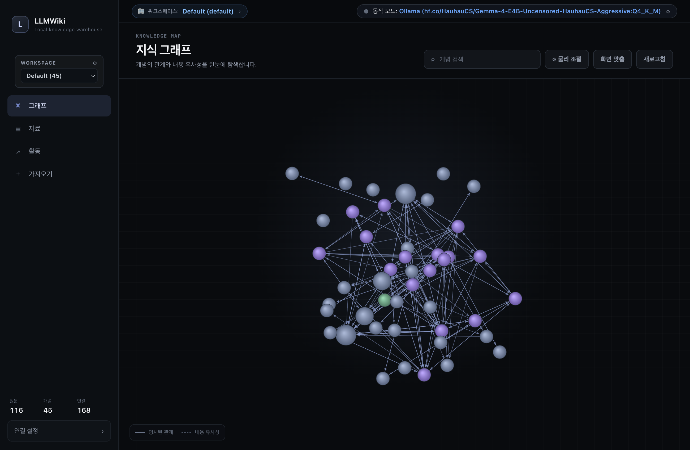
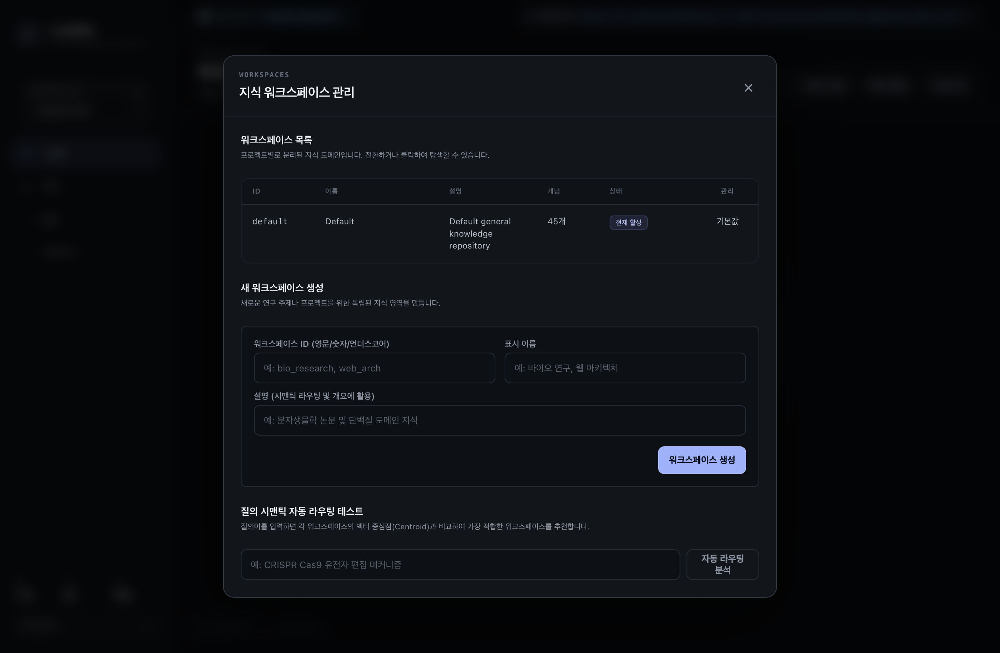
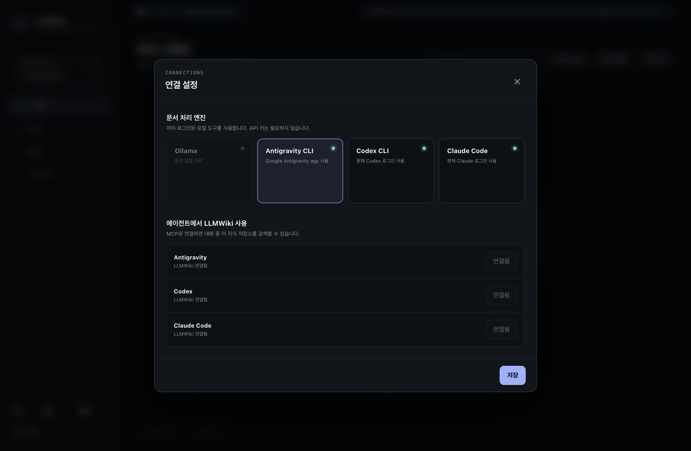
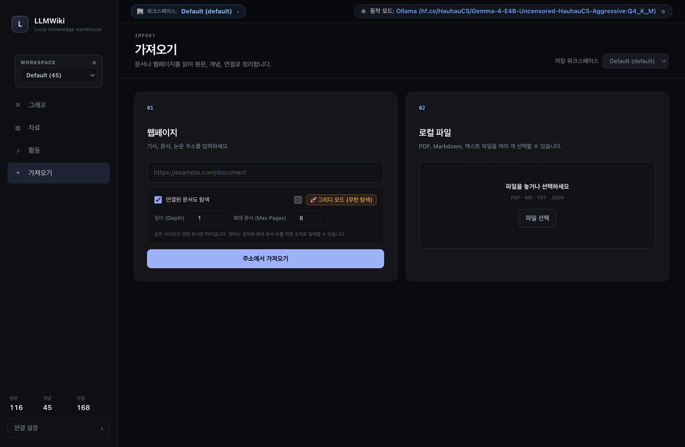

# 🧠 LLMWiki: LLM 전용 3계층 초경량 자율 지식 창고

> **사람이 읽기 위한 문서가 아닌, AI 에이전트(LLM)가 최소한의 토큰으로 최대의 고밀도 지식을 즉각 인출·연결할 수 있도록 설계된 로컬 지식 창고입니다.**

---

## 📸 데스크톱 앱 인터페이스 (Desktop Interface)

LLMWiki 데스크톱 앱은 복잡한 설정 없이 로컬에서 즉시 구동되며, 고속 인터랙티브 지식 그래프와 멀티 워크스페이스를 제공합니다.

| 지식 그래프 탐색 (Knowledge Graph) | 워크스페이스 관리 및 시맨틱 라우팅 |
|:---:|:---:|
|  |  |
| **상단 동작 모드/워크스페이스 인디케이터 & 2D 물리 그래프** | **프로젝트별 독립 도메인 분리 & 벡터 중심점 자동 라우팅** |

| 엔진 선택 및 에이전트 연결 (Settings) | 웹 탐색 및 그리디 무한 가져오기 (Ingest) |
|:---:|:---:|
|  |  |
| **Antigravity CLI, Codex, Claude Code, Ollama 원클릭 연결** | **깊이/문서수 설정, 🚀 그리디 무한 탐색 및 대상 워크스페이스 지정** |

---

## 🏛️ 3계층 아키텍처 (3-Tier Layered Architecture)

LLM의 컨텍스트 윈도우 낭비를 막고, 빠른 인출과 엄밀한 팩트 검증을 동시에 달성하기 위해 지식을 3개 층위로 분리하여 유기적으로 연동합니다.

```
[사용자 / AI 에이전트 질의]
            │
            ▼
┌────────────────────────────────────────────────────────┐
│  Layer 3: 벡터 & 시맨틱 인덱스 (Vector & Search Index)  │
│  - 로컬 임베딩(Ollama / NumPy 코사인 유사도) + SQLite FTS5│
│  - 0.001초 단위의 초고속 시맨틱/키워드 후보 인출     │
│  - 워크스페이스별 대표 벡터 중심점(Centroid) 라우팅   │
└────────────────────────┬───────────────────────────────┘
                         │
                         ▼
┌────────────────────────────────────────────────────────┐
│  Layer 2: 요약본/원자적 지식 (Distilled Concepts)       │
│  - Gemma/Antigravity/Codex가 압축한 고밀도 마크다운    │
│  - 핵심 원리, 수식, 트레이드오프, 상호 관계(Relations)  │
│  - LLM 추론 시 최소 토큰 소모로 최대 정보 전달         │
└────────────────────────┬───────────────────────────────┘
                         │ (필요시 상세 검증/증명 인출)
                         ▼
┌────────────────────────────────────────────────────────┐
│  Layer 1: 원문 보관소 (Raw Document Archive)           │
│  - 원본 논문 텍스트(PDF), 웹페이지 본문, 원본 코드     │
│  - 정확한 수치, 증명, 원문 인용 필요 시에만 드릴다운  │
└────────────────────────────────────────────────────────┘
```

---

## ✨ 핵심 기능

1. **상단 글로벌 동작 모드 & 워크스페이스 인디케이터**:
   - 데스크톱 화면 최상단에서 현재 동작 중인 엔진(**Antigravity CLI, Claude Code, Codex CLI, Ollama**)과 현재 열려 있는 **워크스페이스**를 상시 표시.
   - 클릭 한 번으로 엔진 변경이나 워크스페이스 전환 모달을 즉시 열 수 있습니다.
2. **지식 프로젝트 다중 분리 (Multi-Workspace) & 시맨틱 라우팅**:
   - 서로 다른 연구 주제나 프로젝트(예: `bio_research`, `ml_systems`, `frontend_arch`)별로 지식을 완벽히 격리 보관.
   - 각 워크스페이스의 벡터 중심점(Centroid)을 계산하여, 사용자 질의어가 어느 워크스페이스에 적합한지 0.001초 만에 자동 추천/라우팅.
3. **지능형 웹 탐색 & 🚀 그리디 모드 (무한 탐색)**:
   - 웹페이지 인제스트 시 링크를 타고 들어가는 **탐색 깊이(Depth)**와 **최대 문서 수(Max Pages)**를 유저가 직접 숫자로 입력.
   - **그리디 모드(Greedy Mode)** 활성화 시 제한 없이 연결된 관련 기술 문서를 끝까지 무한 탐색하여 흡수.
4. **개념 노드 웹 딥다이브 (Web Deep Dive)**:
   - 그래프에서 노드를 클릭하고 **`🌐 웹 딥다이브`** 버튼을 누르면, 백엔드 엔진이 관련 키워드로 웹 문서를 자동 크롤링·지식 증류하여 실시간으로 그래프를 확장.
5. **데몬/서버 제로: CLI + Skill 완벽 통합**:
   - 상시 구동 서버 없이, 필요할 때만 고속 네이티브 바이너리 명령 실행.
   - Google Antigravity Skill, Claude Code MCP, OpenAI Codex 지원.

---

## 🚀 빠른 시작 (Quick Start)

### 0. 앱 설치 (Desktop App)

[GitHub Releases](https://github.com/CREE1116/llmwiki/releases)에서 운영체제에 맞는 설치 파일을 받으세요:
- **macOS**: `LLMWiki-1.4.0-mac-arm64.dmg` 또는 `.zip`
- **Windows**: `LLMWiki-1.4.0-win.exe` (NSIS / Portable)
- **Linux**: `LLMWiki-1.4.0.AppImage` 또는 `.deb`

> 설치형 데스크톱 앱에는 네이티브 독립 실행형 `llmwiki` CLI 바이너리가 동봉되어 있어, 파이썬 설치 없이도 바로 동작합니다.

---

### 1. 워크스페이스 관리 (Workspaces)

```bash
# 워크스페이스 목록 확인
llmwiki workspace list

# 새 지식 프로젝트 워크스페이스 생성
llmwiki workspace create bio_research --name "바이오 연구" --desc "CRISPR 및 분자생물학 지식"

# 활성 워크스페이스 전환
llmwiki workspace use bio_research

# 질의어 시맨틱 자동 라우팅 분석
llmwiki workspace route "CRISPR Cas9 유전자 가위 메커니즘"
```

---

### 2. 지식 흡수 (Ingest) & 웹 탐색

```bash
# 로컬 파일(PDF 논문, 마크다운)을 특정 워크스페이스로 흡수
llmwiki ingest ./paper.pdf --workspace bio_research

# 웹 문서 2단계 링크까지 최대 15개 페이지 탐색 흡수
llmwiki ingest https://example.com/docs --explore --depth 2 --max-pages 15

# 🚀 그리디 모드: 연결된 모든 문서를 제한 없이 끝까지 탐색
llmwiki ingest https://docs.python.org/3/tutorial/ --explore --greedy
```

---

### 3. 개념 노드 웹 딥다이브 (Deep Dive)

특정 개념에 대해 웹에서 관련 지식을 찾아 자동으로 지식 그래프를 확장합니다:

```bash
# 특정 개념 ID 딥다이브
llmwiki deep-dive transformer_architecture --depth 1 --max-pages 5

# 맞춤 질의어로 딥다이브
llmwiki deep-dive attention_mechanism --query "FlashAttention GPU kernel optimization"
```

---

### 4. 하이브리드 지식 검색 (Search)

```bash
# 기본 하이브리드 검색 (시맨틱 벡터 + FTS5 키워드 결합)
llmwiki search "GPU memory IO bottleneck"

# 특정 워크스페이스 한정 검색
llmwiki search "CRISPR" --workspace bio_research

# 벡터 전용 / 키워드 전용 검색
llmwiki search "FlashAttention" --mode semantic
llmwiki search "FlashAttention" --mode keyword
```

---

### 5. 지식 상세 조회 (Get) & 그래프 탐색

```bash
# Layer 2 원자적 지식 카드 출력
llmwiki get flash_attention

# 1-hop 연결된 개념 관계망 및 Layer 1 원문 발췌문 함께 보기
llmwiki get flash_attention --neighbors --raw

# 지식 그래프 위상 수학 및 PageRank 중심 개념 조회
llmwiki graph --pagerank
llmwiki graph --communities
```

---

## 🔌 AI 에이전트 연동 (Antigravity / Claude Code / Codex)

앱의 설정 모달에서 버튼 클릭 한 번으로 모든 에이전트 도구를 연동할 수 있습니다.

### 1) Google Antigravity 연동
- 앱 설정에서 `Antigravity` 행의 **[연결]** 버튼을 클릭하면 `~/.gemini/config/skills/llmwiki/SKILL.md` 및 `mcp_config.json`에 자동 등록됩니다.
- 대화 중 Antigravity가 스스로 로컬 창고를 조회하고 인용합니다.

### 2) Claude Code & Codex MCP 연동
```bash
# CLI에서 직접 원클릭 설치
llmwiki install-skills --all
```

---

## 📁 프로젝트 구조

```
llmwiki/
├── app/                      # Electron 데스크톱 앱 소스
│   ├── main.js               # Electron 메인 프로세스 & 네이티브 CLI IPC
│   ├── preload.js            # Context Isolation 안전 브릿지
│   └── renderer/             # HTML5/Canvas UI & 스타일
├── assets/                   # README UI 스크린샷 이미지
├── llmwiki/
│   ├── cli.py                # 터미널용 통합 CLI (990+ lines)
│   ├── config.py             # 설정 관리
│   ├── installer.py          # Antigravity/Codex/Claude 자동 감지 & 연결
│   ├── parser/               # PDF, HTML, Web, Markdown 통합 파서
│   ├── synthesizer/          # 지식 증류 엔진 & DeepDiver
│   │   ├── distiller.py      # LLM 원자적 지식 추출
│   │   ├── deep_diver.py     # 웹 크롤링 기반 개념 딥다이브
│   │   └── llm_client.py     # Ollama/Antigravity/Codex/Claude LLM 클라이언트
│   ├── storage/              # 3계층 스토리지 엔진
│   │   ├── db.py             # SQLite FTS5 + 그래프 + 멀티 워크스페이스
│   │   ├── models.py         # Workspace, Concept, Relation 데이터 모델
│   │   ├── raw_store.py      # Layer 1: 원문 보관소
│   │   ├── store.py          # Layer 2: 원자적 지식 스토어
│   │   ├── vector_index.py   # Layer 3: 벡터 인덱스 & 워크스페이스 센트로이드
│   │   └── graph.py          # NetworkX 지식 그래프 알고리즘
│   └── mcp/                  # 표준 MCP JSON-RPC 서버
├── scripts/                  # 네이티브 PyInstaller 및 빌드 자동화 스크립트
├── tests/                    # 유닛 테스트 모음
├── pyproject.toml            # 패키지 매니페스트
└── README.md
```

---

## 📜 라이선스

MIT License. 자유롭게 연구, 개발, 상업용 프로젝트에 활용하실 수 있습니다.
